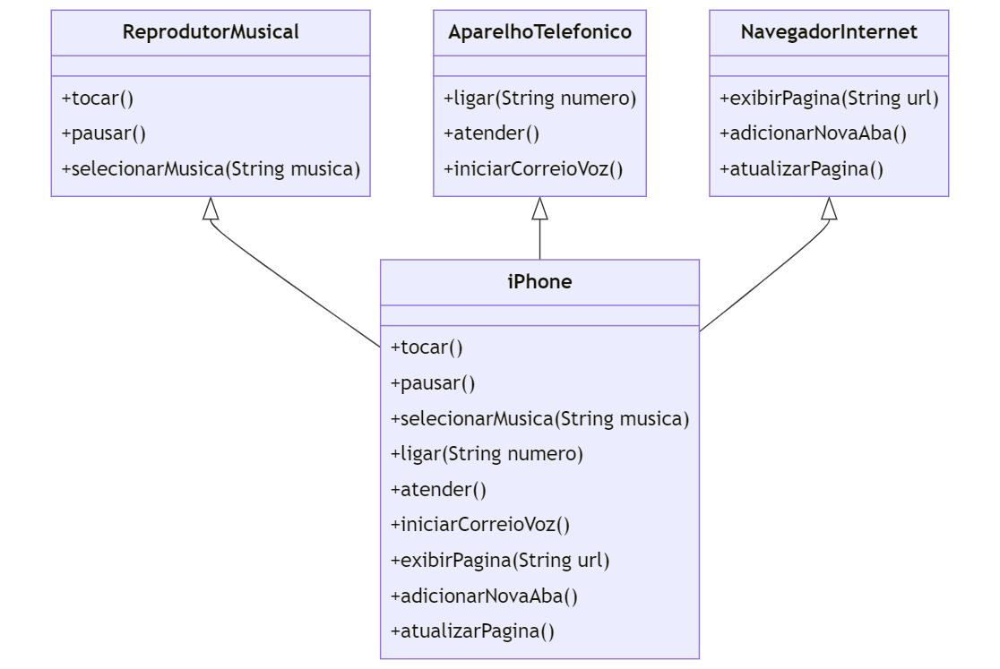

# Modelagem UML: Funcionalidades do iPhone

Este projeto envolve a modelagem e diagramação da representação UML dos componentes principais do iPhone, com foco em suas funcionalidades como **Reprodutor Musical**, **Aparelho Telefônico** e **Navegador de Internet**. O objetivo é aprimorar minhas habilidades em UML e utilizar **Java** para implementar o modelo.

## Objetivo do Projeto

O objetivo deste projeto é criar um diagrama UML detalhado do iPhone, destacando suas principais funções:
- **Reprodutor Musical**: Tocar, pausar, parar e gerenciar arquivos de música. Ex: Ipod.
- **Aparelho Telefônico**: Fazer e receber chamadas, gerenciar contatos.
- **Navegador de Internet**: Acessar páginas web, gerenciar abas e histórico. Ex: Safari.

## Ferramentas Utilizadas

- **Linguagem**: Java
- **IDE**: Visual Studio Code
- **Diagramas UML**: Diagramas de classe, diagramas de atividade e diagramas de sequência são utilizados para representar o comportamento e a estrutura dos componentes do iPhone.

## Objetivos

- Desenvolver diagramas UML para modelar as principais funcionalidades do iPhone.
- Utilizar Java para representar essas funcionalidades por meio de classes e métodos.
- Praticar e aprimorar as técnicas de programação orientada a objetos e modelagem UML.

## Como Executar o Projeto

1. Clone este repositório.
2. Abra o projeto no Visual Studio Code.
3. Certifique-se de que o Java está instalado.
4. Execute as classes Java para simular as diferentes funcionalidades modeladas no diagrama UML.

